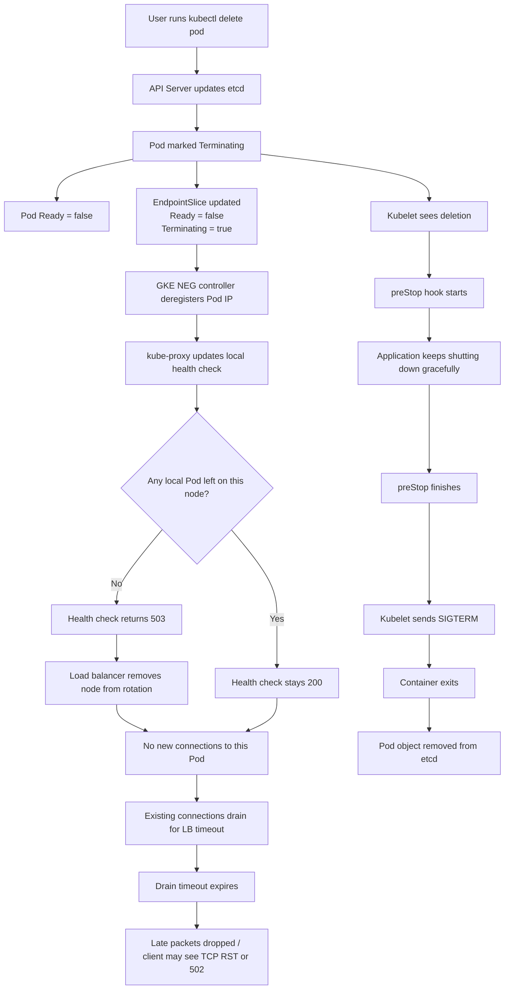

Here is the complete end-to-end breakdown of what happens when a Pod behind an external load balancer using `externalTrafficPolicy: Local` is deleted in GKE.

## Quick Flow Diagram

## At A Glance

- `kubectl delete pod` immediately marks the Pod as `Terminating` and `Ready: false`.
- Two things happen in parallel: network removal starts, and the Pod's `preStop` hook starts.
- The load balancer stops sending new connections quickly, but existing TCP sessions can drain for the configured timeout.
- After `preStop` completes, the container receives `SIGTERM`, exits, and the Pod is fully removed.

* **`kubectl delete pod`** is executed.
* The API Server updates **`etcd`**, applying a `deletionTimestamp` and setting a countdown based on `terminationGracePeriodSeconds` (default 30s).
* The Pod status instantly shifts to **`Terminating`** and its network state drops to **`Ready: false`**.

### 2. Parallel Actions Triggered Instantly (`T = 0s - 5s`)

#### Track A: The Network Infrastructure

* **EndpointSlice Controller:** Detects the `deletionTimestamp` and modifies the Pod's endpoint inside the `EndpointSlice` object (`Ready: false`, `Terminating: true`).
* **GKE NEG Controller:** Detects the EndpointSlice status change and calls the Google Cloud Engine API to **deregister** the Pod IP from the network endpoint group (NEG).
* **`kube-proxy` & Health Check NodePort:**
* If this was the *only* Pod for the service on that specific worker node, `kube-proxy` updates the node's local health check port (e.g., `31795`) response from `HTTP 200 (localEndpoints: 1)` to **`HTTP 503 (localEndpoints: 0)`**.
* The Cloud Load Balancer drops the entire node from rotation for this service.

#### Track B: The Local Worker Node

* **Kubelet:** Monitors `etcd`, notices the deletion request, and immediately runs your configured **`preStop` hook** (e.g., a 30-second sleep).
* **Crucial Detail:** The `preStop` hook runs *in parallel* with the network updates above. It does not delay them.

### 3. Load Balancer Connection Draining (`T = 5s - 20s`)

* **New Connections:** The Cloud Load Balancer completely stops sending brand-new client connections to the terminating Pod.
* **Existing Connections:** The load balancer enters its **Connection Draining Timeout** (e.g., 15 seconds). It keeps routing traffic *only* for established TCP sessions tracked in its connection table.
* **The Hard Cutoff:** Once the draining timeout expires (at 15s), the load balancer evicts the Pod from its connection tracking table. Any late packets sent on those old connections are dropped, and the client receives a connection error (`TCP RST` or `502 Bad Gateway`). They are *not* automatically rerouted to other nodes.

### 4. Application Teardown (`T = 30s+`)

* Your 30-second `preStop` hook finishes sleeping.
* The Kubelet finally sends a polite **`SIGTERM`** signal to PID 1 inside the container, giving the application a brief window to save state and flush internal queues.
* **Final Cleanup:** Once the container processes exit completely, the Kubelet notifies the API Server, which permanently removes the Pod object from `etcd`. The Pod vanishes from `kubectl get pods`.
