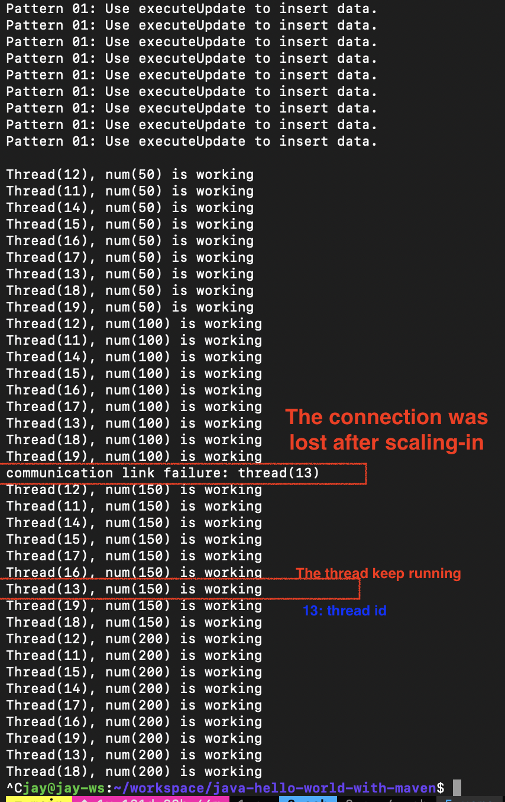
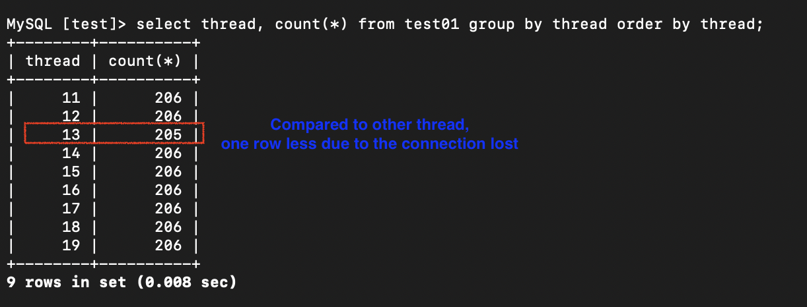
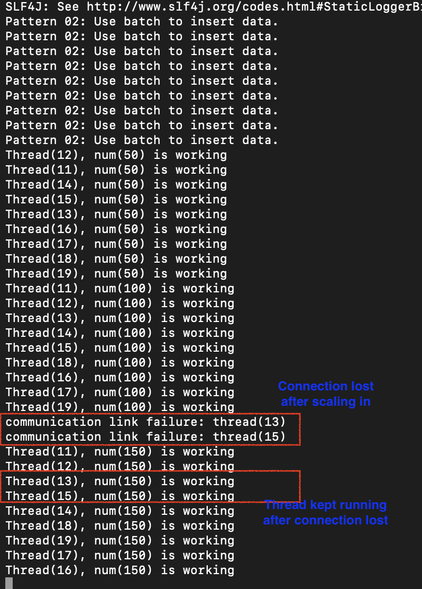
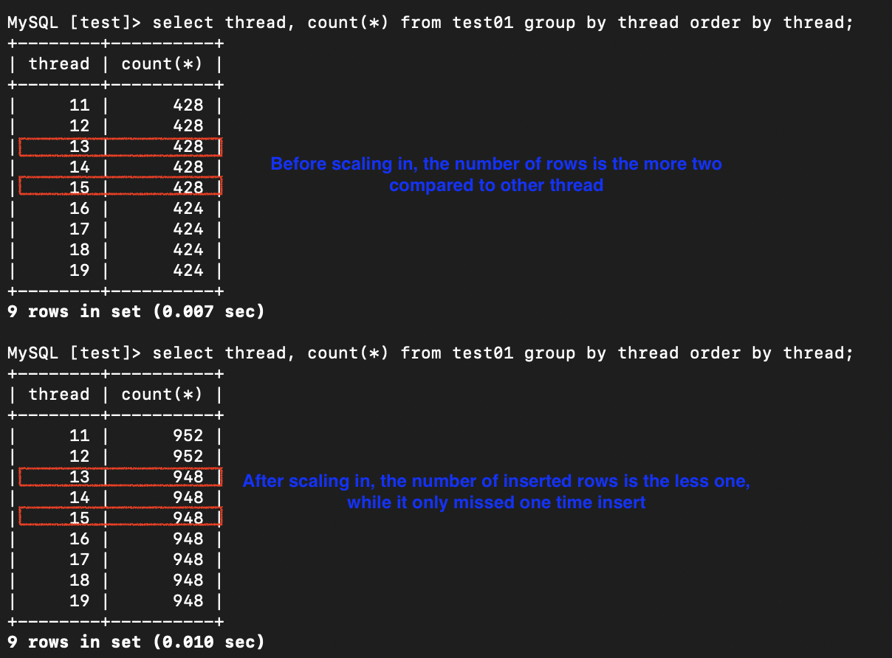

# TiDB Scaling Test with JDBC Connection Pool and HikariCP

## **Objective**
To test whether TiDB's scaling in impacts a Java application that uses **HikariCP** as the connection pool.

---

## **Issue**
When using **JMeter**, scaling in TiDB caused persistent connection errors. JMeter appeared to continue using corrupted connections, leading to failures.

---

## **Verification**
To verify the issue, this custom Java application was prepared to test the behavior under the same conditions. If the custom Java application behaves as expected, the JMeter test can be skipped.

---

## **Custom Java Application Setup**
1. **Connection Pool**: HikariCP
2. **Operations**: The application launches multiple threads to perform database operations every second.
3. **Error Handling**: If connection failures occur, they are logged to stdout while scaling in is performed.

### **DB Operations Tested**
1. **Single Insert**: Using `executeUpdate` to insert one row per second.
2. **Batch Insert**: Using batch operations to insert multiple rows per second.
3. **Multiple Queries**: Executing multiple queries in the same request per second.

### **Connection Options**
The connection string included the following options:
- `allowMultiQueries=true`
- `autoReconnect=true`

These options caused failures in JMeter during scaling in.

---

## **Conclusion**
- During TiDB scaling in, connection failures occurred as expected.
- However, the custom Java application **recovered automatically**, as HikariCP replaced the corrupted connections with safe ones.
- This behavior confirms that the issue in JMeter can be avoided by using a robust connection pool like HikariCP.

---

## **Screenshot**
- Single insert  
  
  
- Batch insert  
  
  
- Multiple queries  
  
  


# Command
## compilation
```
mvn compile
mvn package
```

# execution
```
java -jar target/jb-hello-world-maven-0.2.0.jar
```
