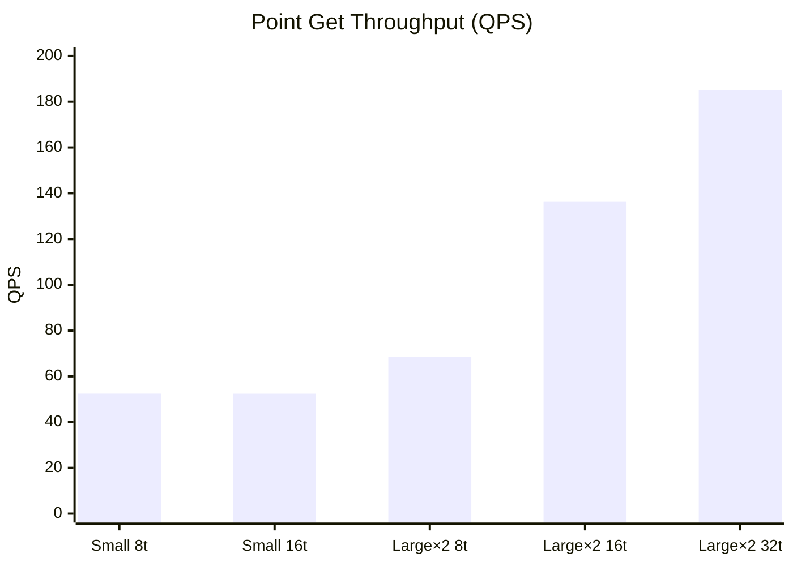
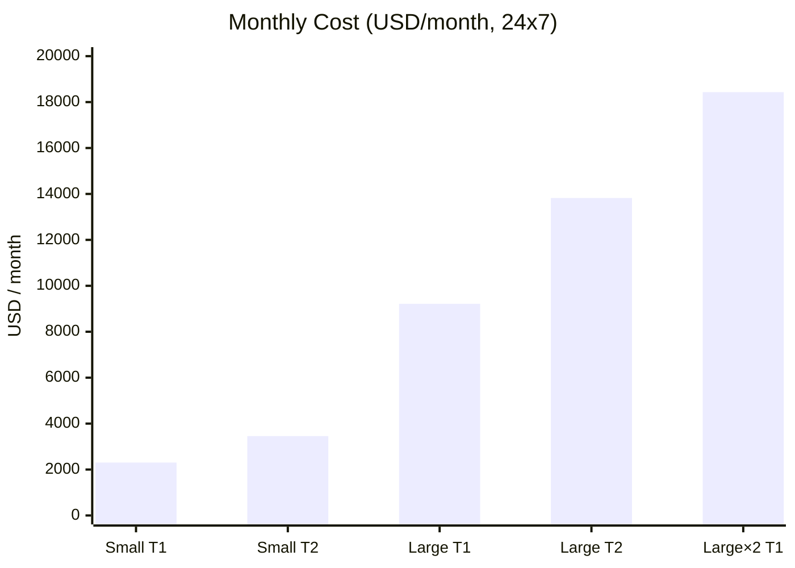
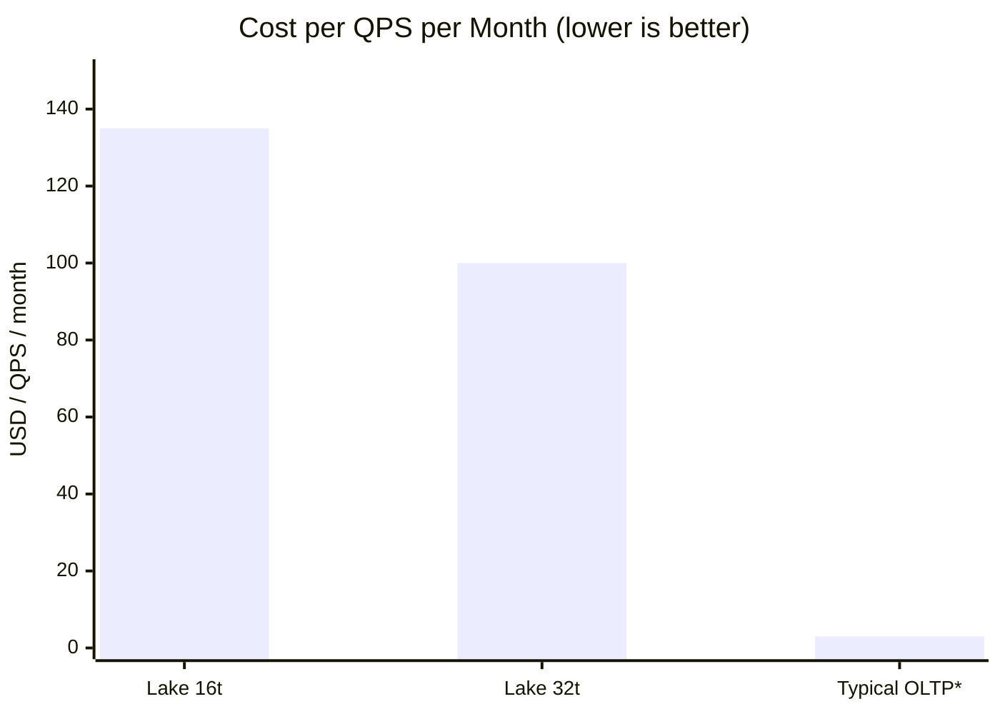

# TiDB Lake Performance Test Report

## 1. Executive Summary

This report summarizes the results of three performance tests conducted on TiDB Lake: **data import**, **data merge (upsert)**, and **point get query** workloads.

**Key Findings**

- **Data import is fast and predictable.** 100 million rows (~7.18 GB) were loaded in **2 min 33 s** on a Small instance.
- **Data merge (upsert) is highly efficient.** 100 million rows (~12.67 GB) were merged in just **9 s** on a Small instance.
- **Point get performance is weak and not suitable for OLTP.** Even on the larger tested configuration (Large × 2 with 32 threads), TiDB Lake peaks at only **~185 QPS** with **P99 latency of 260 ms**. This is roughly **one to two orders of magnitude below** what an OLTP database is expected to deliver (typically thousands to tens of thousands of QPS with single-digit-ms P99).
- **Cost is high relative to throughput.** Sustaining even ~136 QPS requires **two Large instances (~$18,432 / month)**, i.e. roughly **$135 per QPS per month** — an unsustainable ratio for online transactional workloads.

**Bottom line:** TiDB Lake is well suited for **analytical / lake workloads** (bulk import, large-scale upserts, BI queries), but its point-get performance and price/throughput ratio make it **a poor fit for OLTP**. 

---

## 2. Test Environment

| Item | Value |
| --- | --- |
| Workloads tested | Data import, Data merge (upsert), Point get |
| Dataset size | 100 million rows |
| Small instance | r8g.4xlarge (16 vCPU, 128 GB) |
| Large instance | r8g.16xlarge (64 vCPU, 512 GB) |
| Test driver | `tidbcloudlake_driver.BlockingLakeClient` |

---

## 3. Data Import Performance

| Metric | Value |
| --- | --- |
| Row count | 100,000,000 |
| Data size | 7.18 GB |
| Instance type | Small |
| **Time taken** | **2 min 33 s** |

**Throughput:** ~654K rows/sec, ~46.9 MB/sec

---

## 4. Data Merge (Upsert) Performance

| Metric | Value |
| --- | --- |
| Row count | 100,000,000 |
| Data size | 12.67 GB |
| Instance type | Small |
| **Time taken** | **9 s** |

Merge-compaction is essentially a metadata operation at this scale, making upsert extremely cheap.

---

## 5. Point Get Performance

### 5.1 Small (1 node)

#### 8 threads
```
========================================
📈 BENCHMARK REPORT
========================================
Total Successful Queries : 1582
Total Failed Queries     : 0
Total Empty Results      : 0
Actual Duration          : 30.16 seconds
Throughput (QPS)         : 52.45 queries/sec
----------------------------------------
Average Latency          : 151.98 ms
95th Percentile (P95)    : 176.66 ms
99th Percentile (P99)    : 204.65 ms
========================================
```

#### 16 threads
```
========================================
📈 BENCHMARK REPORT
========================================
Total Successful Queries : 1587
Total Failed Queries     : 0
Total Empty Results      : 0
Actual Duration          : 30.27 seconds
Throughput (QPS)         : 52.43 queries/sec
----------------------------------------
Average Latency          : 303.30 ms
95th Percentile (P95)    : 339.64 ms
99th Percentile (P99)    : 364.34 ms
========================================
```

> Observation: A single Small node appears to be CPU/network bound around ~52 QPS; adding more threads does **not** increase throughput and only inflates latency.

### 5.2 Large × 2 (2 nodes)

#### 8 threads
```
========================================
📈 BENCHMARK REPORT
========================================
Total Successful Queries : 2059
Total Failed Queries     : 0
Total Empty Results      : 0
Actual Duration          : 30.09 seconds
Throughput (QPS)         : 68.42 queries/sec
----------------------------------------
Average Latency          : 116.62 ms
95th Percentile (P95)    : 128.49 ms
99th Percentile (P99)    : 156.14 ms
========================================
```

#### 16 threads
```
========================================
📈 BENCHMARK REPORT
========================================
Total Successful Queries : 4103
Total Failed Queries     : 0
Total Empty Results      : 0
Actual Duration          : 30.12 seconds
Throughput (QPS)         : 136.24 queries/sec
----------------------------------------
Average Latency          : 117.09 ms
95th Percentile (P95)    : 142.73 ms
99th Percentile (P99)    : 162.71 ms
========================================
```

#### 32 threads
```
========================================
📈 BENCHMARK REPORT
========================================
Total Successful Queries : 5590
Total Failed Queries     : 0
Total Empty Results      : 0
Actual Duration          : 30.20 seconds
Throughput (QPS)         : 185.13 queries/sec
----------------------------------------
Average Latency          : 171.98 ms
95th Percentile (P95)    : 240.06 ms
99th Percentile (P99)    : 260.67 ms
========================================
```

### 5.3 Side-by-Side Summary

| Configuration | Threads | QPS | Avg Latency | P95 | P99 |
| --- | ---: | ---: | ---: | ---: | ---: |
| Small × 1 | 8 | 52.45 | 151.98 ms | 176.66 ms | 204.65 ms |
| Small × 1 | 16 | 52.43 | 303.30 ms | 339.64 ms | 364.34 ms |
| Large × 2 | 8 | 68.42 | 116.62 ms | 128.49 ms | 156.14 ms |
| Large × 2 | **16** | **136.24** | **117.09 ms** | **142.73 ms** | **162.71 ms** |
| Large × 2 | 32 | 185.13 | 171.98 ms | 240.06 ms | 260.67 ms |

### 5.4 Visual Comparison

**Throughput (QPS)**



**Latency (Avg / P95 / P99, ms)**

```mermaid
xychart-beta
    title "Latency by Configuration (ms)"
    x-axis ["Small 8t", "Small 16t", "Large×2 8t", "Large×2 16t", "Large×2 32t"]
    y-axis "Latency (ms)" 0 --> 400
    bar [151.98, 303.30, 116.62, 117.09, 171.98]
    bar [176.66, 339.64, 128.49, 142.73, 240.06]
    bar [204.65, 364.34, 156.14, 162.71, 260.67]
```



---

## 6. Monthly Cost Estimation

The pricing below is based on the published hourly rate of each instance type, assuming **continuous 24×7 operation (720 hours/month)**.

| Size | Instance / Specs | Hourly Price (Tier 1) | Monthly (Tier 1) | Hourly Price (Tier 2) | Monthly (Tier 2) |
| --- | --- | ---: | ---: | ---: | ---: |
| **Small** | r8g.4xlarge (16 vCPU, 128 GB) | $3.20 | **~$2,304 / month** | $4.80 | **~$3,456 / month** |
| **Large** | r8g.16xlarge (64 vCPU, 512 GB) | $12.80 | **~$9,216 / month** | $19.20 | **~$13,824 / month** |

**Monthly Cost (24×7, 720h/month)**



**Cost per QPS per Month (USD)**



> *Typical OLTP figure is an order-of-magnitude industry estimate for a single-node OLTP engine (e.g. TiDB / MySQL / PostgreSQL) delivering 1,000+ QPS at single-digit ms P99.

**Recommended production configuration cost (Large × 2, Tier 1):**

> 2 × $12.80/h × 720 h = **~$18,432 / month**

**Cost-efficiency at recommended setting (Large × 2, 16 threads):**

- ~136 QPS sustained
- ~$18,432 / month / 136 QPS ≈ **~$135 per QPS per month**
- For reference, a typical OLTP database can deliver **1,000+ QPS per node at single-digit ms latency** for a fraction of that cost — i.e. **10×–100× better price/performance** for point-get workloads.

---

## 7. Recommendations

1. **Do NOT use TiDB Lake as the primary OLTP store.** Even with two Large instances, peak throughput is only ~185 QPS at >170 ms average latency — far below OLTP requirements.
2. **Use TiDB Lake where it shines:** bulk data ingestion, large-scale merge / upsert of cold data, and low-QPS analytical lookups (BI dashboards, occasional enrichments, batch-style queries).
3. **For high-QPS point-get serving,** pair the TiDB lake with a dedicated OLTP engine: use the TiDB lake as the system of record / analytical backbone and an OLTP store as the serving layer.
4. If point-get QPS must stay on the TiDB lake, plan for the cost: ~$135 / QPS / month is the order of magnitude you should expect, and you will still see P99 latency in the hundreds of ms.
