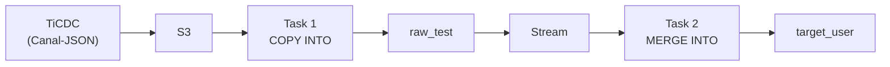

# TiDB CDC (Canal-JSON via S3) -> TiDB Lake End-to-End Synchronization Guide
## Prerequisites
* TiCDC has been configured with an S3 sink and outputs data in Canal-JSON format.
* S3 path layout: `s3://bucket/prefix/{schema}/{table}/{version}/CDCxxxxxx.json`
* Using replication of the TiDB `test.user` table as an example, the source table schema is: `id INT PRIMARY KEY, name VARCHAR(64), age INT`
## Data Flow



### Step 1: S3 IAM role preparation
```yaml
AWSTemplateFormatVersion: '2010-09-09'
Description: 'CloudFormation template to provision cross-account IAM Role for TiDB Lake data integration'

Parameters:
  S3BucketName:
    Type: String
    Description: 'The name of your S3 bucket (e.g., my-tidb-datalake-bucket)'
  
  TiDBPrincipalRoleArn:
    Type: String
    Description: 'The IAM role ARN provided by PingCAP support for TiDB Lake'
    AllowedPattern: '^arn:aws:iam::\d{12}:role/.+$'
    ConstraintDescription: 'Must be a valid IAM role ARN.'

  TiDBExternalId:
    Type: String
    Description: 'The unique External ID generated/provided by your TiDB Console setup'

Resources:
  TiDBLakeCrossAccountRole:
    Type: 'AWS::IAM::Role'
    Properties:
      RoleName: !Sub 'tidb-lake-integration-role-${AWS::Region}'
      Description: 'Cross-account IAM role for TiDB Lake S3 access'
      
      # Trust Relationship configuration
      AssumeRolePolicyDocument:
        Version: '2012-10-17'
        Statement:
          - Effect: Allow
            Principal:
              AWS: !Ref TiDBPrincipalRoleArn
            Action: 'sts:AssumeRole'
            Condition:
              StringEquals:
                'sts:ExternalId': !Ref TiDBExternalId
                
      # S3 Read/Write & Bucket-level Permissions Policies
      Policies:
        - PolicyName: TiDBS3AccessPolicy
          PolicyDocument:
            Version: '2012-10-17'
            Statement:
              - Sid: ReadWriteActions
                Effect: Allow
                Action:
                  - 's3:PutObject'
                  - 's3:GetObject'
                  - 's3:GetObjectVersion'
                  - 's3:DeleteObject'
                Resource: !Sub 'arn:aws:s3:::${S3BucketName}/*'
              - Sid: BucketLevelActions
                Effect: Allow
                Action:
                  - 's3:ListBucket'
                  - 's3:GetBucketLocation'
                Resource: !Sub 'arn:aws:s3:::${S3BucketName}'

Outputs:
  RoleARN:
    Description: 'The ARN of the newly created cross-account role to provide back to TiDB Setup'
    Value: !GetAtt TiDBLakeCrossAccountRole.Arn
```

```sh
$ aws cloudformation create-stack \
  --stack-name tidb-lake-s3-integration \
  --template-body file://tidb-s3-role.yaml \
  --parameters \
    ParameterKey=S3BucketName,ParameterValue=YOUR_ACTUAL_BUCKET_NAME \
    ParameterKey=TiDBPrincipalRoleArn,ParameterValue=arn:aws:iam::dddddddddd:role/mars/tn3lzc8fp/mars-tn3lzc8fp \
    ParameterKey=TiDBExternalId,ParameterValue=YOUR_EXTERNAL_ID_FROM_TIDB \
  --capabilities CAPABILITY_NAMED_IAM
{
    "StackId": "arn:aws:cloudformation:ap-northeast-1:dddddddddddd:stack/tidb-lake-s3-integration/ab503100-7867-11f1-adcf-0ea445948b01",
    "OperationId": "c3a88850-7868-11f1-a72e-06416d3f1579"
}

$ aws cloudformation describe-stacks \
  --stack-name tidb-lake-s3-integration \
  --query "Stacks[0].Outputs[?OutputKey=='RoleARN'].OutputValue" \
  --output text
arn:aws:iam::dddddddddddd:role/tidb-lake-integration-role-ap-northeast-1
```
### Step 2: Create the S3 Connection and External Stage
```sql
CREATE CONNECTION IF NOT EXISTS tidb_cdc_s3_conn
    STORAGE_TYPE = 's3'
    ROLE_ARN = 'arn:aws:iam::xxxxxxxxxxxx:role/rolename'
    EXTERNAL_ID = 'your-external-id';

-- The stage points to the S3 path for the specific table
CREATE STAGE IF NOT EXISTS tidb_cdc_user_stage
    URL = 's3://<your-bucket>/<prefix>/test/user/'
    CONNECTION = (CONNECTION_NAME = 'tidb_cdc_s3_conn');
```
### Step 3: Create the `raw_test` Staging Table (Canal-JSON Structure)
* Each row corresponds to one Canal-JSON event. The columns map one-to-one to Canal-JSON keys, and NDJSON loading automatically maps fields by column name.

```sql
CREATE TABLE IF NOT EXISTS raw_test (
    `id`        INT          NULL,
    `database`  VARCHAR      NULL,
    `table`     VARCHAR      NULL,
    `pkNames`   VARIANT      NULL,
    `isDdl`     BOOLEAN      NULL,
    `type`      VARCHAR      NULL,   -- INSERT / UPDATE / DELETE
    `es`        BIGINT       NULL,   -- TiDB event timestamp
    `ts`        BIGINT       NULL,   -- TiCDC processing timestamp
    `sql`       VARCHAR      NULL,
    `sqlType`   VARIANT      NULL,
    `mysqlType` VARIANT      NULL,
    `data`      VARIANT      NULL,   -- Row data after the change [{"col":"val",...}]
    `old`       VARIANT      NULL    -- Row data before the change (null for INSERT)
);
```
### Step 4: Create the TiDB Lake Target Table
* Create it based on your TiDB source table schema. The example below uses `test.user`:

```sql
CREATE TABLE IF NOT EXISTS target_user (
    id   INT          NOT NULL,
    name VARCHAR(64)  NULL,
    age  INT          NULL
);
```

### Step 5: Create a Stream on `raw_test`
* `APPEND_ONLY = true`: `raw_test` is only written by `COPY INTO` (INSERT), so there is no need to track UPDATE/DELETE.
* The stream automatically records the consumption offset and advances after `MERGE INTO` consumes the data.
```sql
CREATE STREAM IF NOT EXISTS raw_test_stream
    ON TABLE raw_test
    APPEND_ONLY = true;
```

### Step 6: Create Task 1 - Periodically Load Canal-JSON from S3 into `raw_test`
* `PURGE = true`: delete files from S3 after a successful load to avoid duplicate ingestion.
* `PATTERN`: matches all `.json` files, including files in subdirectories such as versioned table folders.
```sql
CREATE TASK task_load_cdc_raw
    WAREHOUSE = 'default'
    SCHEDULE = 1 MINUTE
    SUSPEND_TASK_AFTER_NUM_FAILURES = 3
AS
    COPY INTO dbname.raw_test
    FROM @tidb_cdc_user_stage
    PATTERN = '.*\.json'
    FILE_FORMAT = (
        TYPE = NDJSON,
        MISSING_FIELD_AS = NULL
    )
    PURGE = true;
```
### Step 7: Create Task 2 - Consume Data from the Stream and `MERGE INTO` the Target Table
* `AFTER task_load_cdc_raw`: triggered after Task 1 finishes.
* `WHEN STREAM_STATUS`: runs only when there is new data in the stream.

#### MERGE logic:
* Extract business columns from the Canal-JSON `data` / `old` fields in the stream.
* The same primary key may have multiple changes within one batch, so `ROW_NUMBER` is used to keep only the latest one.
* `MATCHED + DELETE`: handles deletes.
* `MATCHED + non-DELETE`: handles updates, including the scenario where a row is deleted and then inserted again.
* `NOT MATCHED + non-DELETE`: handles inserts.
```sql
CREATE TASK task_merge_to_target
    WAREHOUSE = 'default'
    AFTER 'task_load_cdc_raw'
    WHEN STREAM_STATUS('dbname.raw_test_stream') = TRUE
    SUSPEND_TASK_AFTER_NUM_FAILURES = 3
AS
    MERGE INTO dbname.target_user AS t
    USING (
        SELECT * FROM (
            SELECT
                COALESCE(`data`[0]:id, `old`[0]:id)::INT       AS id,
                COALESCE(`data`[0]:name, `old`[0]:name)::VARCHAR AS name,
                COALESCE(`data`[0]:age, `old`[0]:age)::INT      AS age,
                `type`  AS _action,
                `ts`    AS _ts
            FROM dbname.raw_test_stream
            WHERE `isDdl` = false OR `isDdl` IS NULL
        )
        QUALIFY ROW_NUMBER() OVER (PARTITION BY id ORDER BY _ts DESC) = 1
    ) AS s
    ON t.id = s.id
    WHEN MATCHED AND s._action = 'DELETE' THEN DELETE
    WHEN MATCHED AND s._action != 'DELETE' THEN
        UPDATE SET t.id = s.id, t.name = s.name, t.age = s.age
    WHEN NOT MATCHED AND s._action != 'DELETE' THEN
        INSERT (id, name, age) VALUES (s.id, s.name, s.age);
```
### Step 7: Start the Tasks
* Start the downstream task first, then the root task, so the downstream task is ready before the root task begins scheduling.
```sql
ALTER TASK task_merge_to_target RESUME;
ALTER TASK task_load_cdc_raw RESUME;
```
### Operations Reference
```sql
Show task status

-- Show task status
SHOW TASKS;

-- Show task execution history
SELECT * FROM TABLE(TASK_HISTORY()) ORDER BY scheduled_time DESC LIMIT 20;

-- Suspend tasks (stop the root task first, then the downstream task)
ALTER TASK task_load_cdc_raw SUSPEND;
ALTER TASK task_merge_to_target SUSPEND;

-- Trigger execution manually (for debugging)
EXECUTE TASK task_load_cdc_raw;

-- Check unconsumed data in the stream
SELECT * FROM raw_test_stream LIMIT 10;

-- Check the row count in raw_test (for periodic cleanup)
SELECT COUNT(*) FROM raw_test;

-- Clean up consumed historical data (old data can be safely deleted after stream consumption)
DELETE FROM raw_test WHERE `ts` < <some_timestamp>;
```
### Adapting This for Your Own Table
Items you need to modify:

| Location | What to change |
| --- | --- |
| Step 1 | Replace the S3 credentials and bucket path with your actual values |
| Step 3 | Replace the `target_user` schema with your actual TiDB source table schema |
| Step 5 | Adjust the `SCHEDULE` interval based on your latency requirement |
| Step 6 USING subquery | Replace `data[0]:'column_name'` with your actual column names and type casts |
| Step 6 ON condition | Replace `t.id = s.id` with your actual primary key matching condition |
| Step 6 UPDATE SET | List the actual columns that should be updated |
| Step 6 INSERT | List the actual columns that should be inserted |
